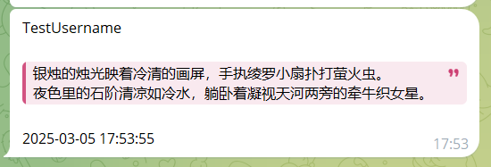
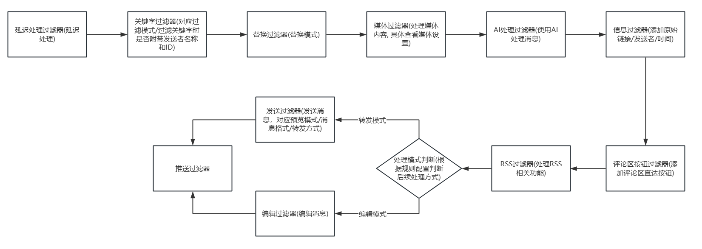
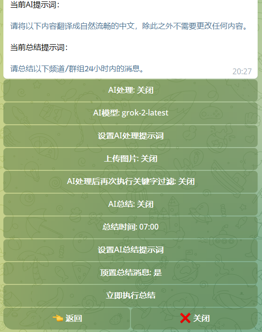
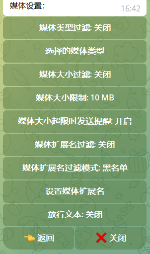
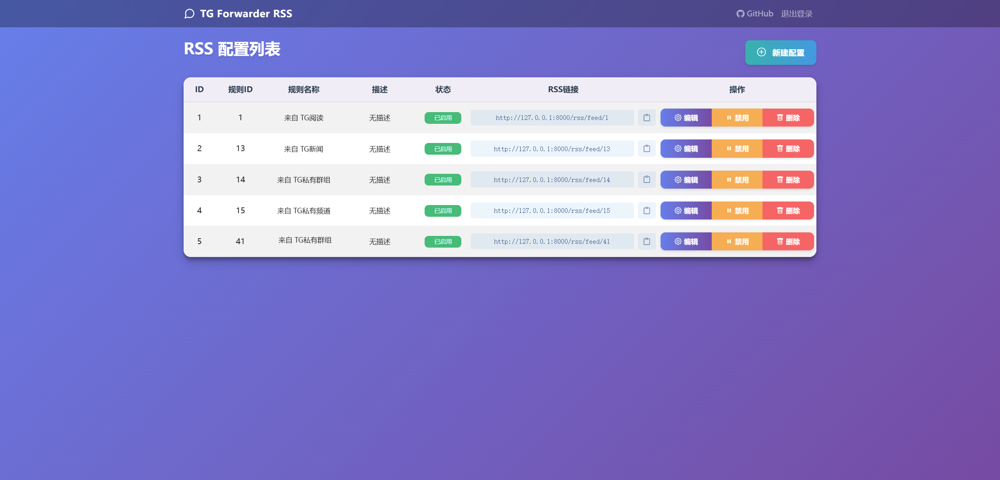

<h3><div align="center">Telegram 转发器 | Telegram Forwarder</div>

---

<div align="center">

[][docker-url] [](https://github.com/Heavrnl/TelegramForwarder/blob/main/LICENSE)

[docker-url]: https://hub.docker.com/r/heavrnl/telegramforwarder

</div>

## 📋 目录

- [📖 简介](#-简介)
- [✨ 特性](#-特性)
- [🚀 快速开始](#-快速开始)
  - [1️⃣ 准备工作](#1️⃣-准备工作)
  - [2️⃣ 配置环境](#2️⃣-配置环境)
  - [3️⃣ 启动服务](#3️⃣-启动服务)
  - [4️⃣ 更新](#4️⃣-更新)
- [📚 使用指南](#-使用指南)
  - [🌟 基础使用示例](#-基础使用示例)
  - [🔧 特殊使用场景示例](#-特殊使用场景示例)
- [🛠️ 功能详解](#️-功能详解)
  - [⚡ 过滤流程](#-过滤流程)
  - [⚙️ 设置说明](#️-设置说明)
    - [主设置说明](#主设置说明)
    - [媒体设置说明](#媒体设置说明)
  - [🤖 AI功能](#-ai功能)
    - [配置说明](#配置)
    - [自定义模型](#自定义模型)
    - [AI处理能力](#ai-处理)
    - [定时总结功能](#定时总结)
  - [📰 RSS订阅](#-RSS订阅)
    - [启用RSS功能](#启用rss功能)
    - [访问RSS仪表盘](#访问rss仪表盘) 
    - [Nginx配置](#nginx配置)
    - [RSS配置说明](#rss配置管理)
    - [特殊设置项](#特殊设置项)
    - [注意事项](#注意事项)
  
- [🎯 特殊功能](#-特殊功能)
  - [🔗 链接转发功能](#-链接转发功能)
  - [🔄 与通用论坛屏蔽插件联动](#-与通用论坛屏蔽插件联动)
- [📝 命令列表](#-命令列表)
- [☕ 捐赠](#-捐赠)
- [📄 开源协议](#-开源协议)

## 📖 简介
Telegram 转发器是一个消息转发工具，只需要你的账号加入频道/群聊即可以将指定聊天中的消息转发到其他聊天，不需要bot进入对应的频道/群组即可监听。可用于**信息流整合过滤**，**消息提醒**，**内容收藏**等多种场景。

## ✨ 特性

- 🔄 **多源转发**：支持从多个来源转发到指定目标
- 🔍 **关键词过滤**：支持白名单和黑名单模式
- 📝 **正则匹配**：支持正则表达式匹配目标文本
- 📋 **内容修改**：支持多种方式修改消息内容
- 🤖 **AI 处理**：支持使用各大厂商的AI接口
- 📹 **媒体过滤**：支持过滤指定类型的媒体文件
- 📰 **RSS订阅**：支持RSS订阅
- 🔗 **联动同步**：支持与[通用论坛屏蔽插件](https://github.com/heavrnl/universalforumblock)联动同步，实现三端屏蔽

## 🚀 快速开始

### 1️⃣ 准备工作

1. 获取 Telegram API 凭据：
   - 访问 https://my.telegram.org/apps
   - 创建一个应用获取 `API_ID` 和 `API_HASH`

2. 获取机器人 Token：
   - 与 @BotFather 对话创建机器人
   - 获取机器人的 `BOT_TOKEN`

3. 获取用户 ID：
   - 与 @userinfobot 对话获取你的 `USER_ID`

### 2️⃣ 配置环境

新建文件夹
```bash
mkdir ./TelegramForwarder && cd ./TelegramForwarder
```
新建`.env`文件，填写参数，或者直接下载仓库的`.env.example`文件
```bash
wget https://raw.githubusercontent.com/Heavrnl/TelegramForwarder/refs/heads/main/.env.example -O .env
```
```ini
# Telegram API 配置 (从 https://my.telegram.org/apps 获取)
API_ID=
API_HASH=

# 用户账号登录用的手机号 (格式如: +8613812345678)
PHONE_NUMBER=

# Bot Token
BOT_TOKEN=

# 用户ID (从 @userinfobot 获取)
USER_ID=

# 默认最大媒体文件大小限制（单位：MB）
DEFAULT_MAX_MEDIA_SIZE=15

# RSS配置
# 是否启用RSS功能 (true/false)
RSS_ENABLED=true
# RSS基础访问URL，留空则使用默认的访问URL（例如：https://rss.example.com）
RSS_BASE_URL=
# RSS媒体文件基础URL，留空则使用默认的访问URL（例如：https://media.example.com）
RSS_MEDIA_BASE_URL=

# bot消息删除时间 (秒),0表示立即删除, -1表示不删除
BOT_MESSAGE_DELETE_TIMEOUT=60

# 是否自动删除用户发送的指令消息 (true/false)
USER_MESSAGE_DELETE_ENABLE=true

# 数据库配置
DATABASE_URL=sqlite:///./db/forward.db

# UI 布局配置
AI_MODELS_PER_PAGE=10
KEYWORDS_PER_PAGE=10
SUMMARY_TIME_ROWS=10  
SUMMARY_TIME_COLS=6
DELAY_TIME_ROWS=10
DELAY_TIME_COLS=6
MEDIA_SIZE_ROWS=10
MEDIA_SIZE_COLS=6
MEDIA_EXTENSIONS_ROWS=10
MEDIA_EXTENSIONS_COLS=6


# 默认AI模型
DEFAULT_AI_MODEL=gemini-2.0-flash

# OpenAi API Key
OPENAI_API_KEY=your_openai_api_key
# 留空使用官方接口 https://api.openai.com/v1
OPENAI_API_BASE=  

# Claude API Key
CLAUDE_API_KEY=your_claude_api_key
# 留空使用官方接口
CLAUDE_API_BASE=

# Gemini API Key
# 默认使用官方接口
GEMINI_API_KEY=your_gemini_api_key
# 兼容OpenAI接口标准的第三方API Base，如官方的：https://generativelanguage.googleapis.com/v1beta
GEMINI_API_BASE=

# DeepSeek API Key
DEEPSEEK_API_KEY=your_deepseek_api_key
# 留空使用官方接口 https://api.deepseek.com/v1
DEEPSEEK_API_BASE=  

# Qwen API Key
QWEN_API_KEY=your_qwen_api_key
# 留空使用官方接口 https://dashscope.aliyuncs.com/compatible-mode/v1
QWEN_API_BASE=  

# Grok API Key
GROK_API_KEY=your_grok_api_key
# 留空使用官方接口 https://api.x.ai/v1
GROK_API_BASE=     

# 默认AI提示词
DEFAULT_AI_PROMPT=请尊重原意，保持原有格式不变，用简体中文重写下面的内容：

# 默认AI总结提示词
DEFAULT_SUMMARY_PROMPT=请总结以下频道/群组24小时内的消息。
# 默认总结时间 (24小时制)
DEFAULT_SUMMARY_TIME=07:00
# 默认时区
DEFAULT_TIMEZONE=Asia/Shanghai
# 聊天信息更新时间 (24小时制)
CHAT_UPDATE_TIME=03:00

# AI总结每次爬取消息数量
SUMMARY_BATCH_SIZE=20
# AI总结每次爬取消息间隔时间（秒）
SUMMARY_BATCH_DELAY=2


######### 扩展内容 #########

# 是否开启与通用论坛屏蔽插件服务端的同步服务 (true/false)
UFB_ENABLED=false
# 服务端地址
UFB_SERVER_URL=
# 用户API_KEY
UFB_TOKEN=

```

新建 `docker-compose.yml` 文件，内容如下：

```yaml
services:
  telegram-forwarder:
    image: heavrnl/telegramforwarder:latest
    container_name: telegram-forwarder
    ports:
      - 9804:8000
    restart: unless-stopped
    volumes:
      - ./db:/app/db
      - ./.env:/app/.env
      - ./logs:/app/logs
      - ./sessions:/app/sessions
      - ./temp:/app/temp
      - ./ufb/config:/app/ufb/config
      - ./config:/app/config
      - ./rss/data:/app/rss/data
      - ./rss/media:/app/rss/media
    logging:
      driver: "json-file"
      options:
        max-size: "10m"
        max-file: "3"
        compress: "true"
    stdin_open: true
    tty: true
```

### 3️⃣ 启动服务

首次运行（需要验证）：

```bash
docker-compose run -it telegram-forwarder
```
CTRL+C 退出容器

修改 docker-compose.yml 文件，修改 `stdin_open: false` 和 `tty: false`

后台运行：
```bash
docker-compose up -d
```

### 4️⃣ 更新
注意：docker-compose运行不需要拉取仓库源码，除非你打算自己build，否则只需要在项目目录执行以下命令即可更新。
```bash
docker-compose down
```
```bash
docker-compose pull
```
```bash
docker-compose up -d
```
## 📚 使用指南

### 🌟 基础使用示例

假设订阅了频道 "TG 新闻" (https://t.me/tgnews) 和 "TG 阅读" (https://t.me/tgread) ，但想过滤掉一些不感兴趣的内容：

1. 创建一个 Telegram 群组/频道（例如："My TG Filter"）
2. 将机器人添加到群组/频道，并设置为管理员
3. 在**新创建**的群组/频道中发送命令：
   ```bash
   /bind https://t.me/tgnews 或者 /bind "TG 新闻"
   /bind https://t.me/tgread 或者 /bind "TG 阅读"
   ```
    或者使用两个参数，第一个参数是源聊天窗口链接或名称，第二个参数是目标聊天窗口链接或名称
   ```bash
   /bind https://t.me/tgnews 当前聊天窗口名字/连接
   /bind https://t.me/tgread 当前聊天窗口名字/连接
   ```
4. 设置消息处理模式：
   ```bash
   /settings
   ```
   选择要操作的对应频道的规则，根据喜好设置
   
   详细设置说明请查看 [🛠️ 功能详解](#️-功能详解)

5. 添加屏蔽关键词：
   ```bash
   /add 广告 推广 '这是 广告'
   ```

6. 如果发现转发的消息格式有问题（比如有多余的符号），可以使用正则表达式处理：
   ```bash
   /replace \*\*
   ```
   这会删除消息中的所有 `**` 符号

>注意：以上增删改查操作，只对第一个绑定的规则生效，示例里是TG 新闻。若想对TG 阅读进行操作，需要先使用`/settings(/s)`，选择TG 阅读，再点击"应用当前规则"，就可以对此进行增删改查操作了。也可以使用`/add_all(/aa)`，`/replace_all(/ra)`等指令同时对两条规则生效

这样，你就能收到经过过滤和格式化的频道消息了

### 🔧 特殊使用场景示例  

#### 1. TG 频道的部分消息由于文字嵌入链接，点击会让你确认再跳转，例如 NodeSeek 的官方通知频道  

频道的原始消息格式 
```markdown
[**贴子标题**](https://www.nodeseek.com/post-xxxx-1)
```  
可以对通知频道的转发规则 **依次** 使用以下指令：  
```plaintext
/replace \*\*
/replace \[(?:\[([^\]]+)\])?([^\]]+)\]\(([^)]+)\) [\1]\2\n(\3)
/replace \[\]\s*
```  
最终所有转发的消息都会变成以下格式，这样直接点击链接就无需确认跳转：  
```plaintext
贴子标题
(https://www.nodeseek.com/post-xxxx-1)
```  

---

#### 2. 监听用户消息格式不美观，可优化消息显示方式  

**依次** 使用以下指令：  
```plaintext
/r ^(?=.) <blockquote>
/r (?<=.)(?=$) </blockquote>
```  
然后设置消息格式为 **HTML**，这样监听用户消息时，消息格式就会美观很多：  



## 🛠️ 功能详解

### ⚡ 过滤流程
首先要清楚消息过滤顺序，括号里对应设置里的选项：



### ⚙️ 设置说明
| 主设置界面 | AI设置界面 | 媒体设置界面 |
|---------|------|------|
|  |  |  |

#### 主设置说明
以下对设置选项进行说明
| 设置选项 | 说明 |
|---------|------|
| 应用当前规则 | 选择后，关键字指令(/add,/remove_keyword,/list_keyword等)和替换指令(/replace,/list_replace等)的增删改查导入导出将作用于当前规则 |
| 是否启用规则 | 选择后，当前规则将被启用，否则将被禁用 |
| 当前关键字添加模式 | 点击可切换黑/白名单模式，由于黑白名单是分开处理的，需要手动切换，注意，此时关键字的增删改查都和这里的模式有关，如果要使用指令对当前规则的白名单进行增删改查操作，请确保这里的模式是白名单 |
| 过滤关键字时是否附带发送者名称和ID | 启用后，过滤关键字时会包含发送者名称和ID信息(不会添加到实际消息中)，可用于针对特定用户进行过滤 |
| 处理模式 | 可切换编辑/转发模式。编辑模式下会直接修改原消息；转发模式下会将处理后的消息转发到目标聊天。注意:编辑模式仅适用于你是管理员的且原消息是频道消息或群组中自己发送的消息 |
| 过滤模式 | 可切换仅黑名单/仅白名单/先黑后白/先白后黑模式。由于黑白名单分开存储，可根据需要选择不同的过滤方式 |
| 转发模式 | 可切换用户/机器人模式。用户模式下使用用户账号转发消息；机器人模式下使用机器人账号发送消息 |
| 替换模式 | 启用后将根据已设置的替换规则对消息进行处理 |
| 消息格式 | 可切换Markdown/HTML格式，在最终发送阶段生效，一般使用默认的Markdown即可 |
| 预览模式 | 可切换开启/关闭/跟随原消息。开启后会预览消息中的第一个链接，默认跟随原消息的预览状态 |
| 原始发送者/原始链接/发送时间 | 启用后会在消息发送时添加这些信息，默认关闭 |
| 延时处理 | 启用后会按设定的延迟时间重新获取原消息内容，再开始处理流程，适用于频繁修改消息的频道/群组，可在 config/delay_time.txt 中添加自定义延迟时间 |
| 删除原始消息 | 启用后会删除原消息，使用前请确认是否有删除权限 |
| 评论区直达按钮 | 启用后在转发后的消息下发添加评论区直达按钮，前提是原消息有评论区 |

#### 媒体设置说明
| 设置选项 | 说明 |
|---------|------|
| 媒体类型过滤 | 启用后会过滤掉非选中的媒体类型 |
| 选择的媒体类型 | 选择要**屏蔽**的媒体类型，注意：Telegram对媒体文件的分类是固定的，主要就是这几种，图片 (photo)，文档 (document)，视频 (video)，音频 (audio)，语音 (voice)，其中所有不属于图片、视频、音频、语音的文件都会被归类为"文档"类型。比如病毒文件(.exe)、压缩包(.zip)、文本文件(.txt)等，在 Telegram 中都属于"文档"类型。 |
| 媒体大小过滤 | 启用后会过滤掉超过设置大小的媒体 |
| 媒体大小限制 | 设置媒体大小限制，单位：MB，可在 config/media_size.txt 中添加自定义大小 |
| 媒体大小超限时发送提醒 | 启用后媒体超限会发送提醒消息 |
| 媒体扩展名过滤 | 启用后会过滤掉选中的媒体扩展名 |
| 媒体扩展名过滤模式 | 切换黑/白名单模式 |
| 选择的媒体扩展名 | 选择要过滤的的媒体扩展名，可在 config/media_extensions.txt 中添加自定义扩展名 |


### 🤖 AI功能

项目内置了各大厂商的AI接口，可以帮你：
- 自动翻译外语内容
- 定时总结群组消息
- 智能过滤广告信息
- 自动为内容打标签
....
  
#### 配置

1. 在 `.env` 文件中配置你的 AI 接口：
```ini
# OpenAI API
OPENAI_API_KEY=your_key
OPENAI_API_BASE=  # 可选，默认官方接口

# Claude API
CLAUDE_API_KEY=your_key

# 其他支持的接口...
```

#### 自定义模型

没找到想要的模型名字？在 `config/ai_models.json` 中添加即可。

#### AI 处理

AI处理提示词中可以使用以下格式：
- `{source_message_context:数字}` - 获取源聊天窗口最新的指定数量消息
- `{target_message_context:数字}` - 获取目标聊天窗口最新的指定数量消息
- `{source_message_time:数字}` - 获取源聊天窗口最近指定分钟数的消息
- `{target_message_time:数字}` - 获取目标聊天窗口最近指定分钟数的消息

提示词示例：

前置：开启AI处理后再次执行关键词过滤，把“#不转发”添加到过滤关键字中
```
这是一个资讯整合频道，从多个源获取消息，现在你要判断新资讯是否和历史资讯内容重复了，若重复，则只需要回复“#不转发”，否则请返回新资讯的原文并保持格式。
记住，你只能返回“#不转发”或者新资讯的原文。
以下是历史资讯：{target_message_context:10}
以下是新资讯：
```

#### 定时总结

开启定时总结后，机器人会在指定时间（默认每天早上 7 点）自动总结过去 24 小时的消息。

- 可在 `config/summary_time.txt` 中添加多个总结时间点
- 在 `.env` 中设置默认时区
- 自定义总结的提示词

> 注意：总结功能会消耗较多的 API 额度，请根据需要开启。

## 📰 RSS订阅

项目集成了将Telegram消息转换为RSS Feed的功能，可以轻松地将Telegram频道/群组内容转为标准RSS格式，方便通过RSS阅读器跟踪。

### 启用RSS功能

1. 在 `.env` 文件中配置RSS相关参数：
   ```ini
   # RSS配置
   # 是否启用RSS功能 (true/false)
   RSS_ENABLED=true
   # RSS基础访问URL，留空则使用默认的访问URL（例如：https://rss.example.com）
   RSS_BASE_URL=
   # RSS媒体文件基础URL，留空则使用默认的访问URL（例如：https://media.example.com）
   RSS_MEDIA_BASE_URL=
   ```

2. 重启服务以启用RSS功能：
   ```bash
   docker-compose restart
   ```
> 注意：旧版本用户需要用新的docker-compose.yml文件重新部署：[docker-compose.yml](./docker-compose.yml)
### 访问RSS仪表盘

浏览器访问 `http://你的服务器地址:9804/`

### Nginx配置
```
 location / {
        proxy_pass http://127.0.0.1:9804;
        proxy_http_version 1.1;
        proxy_set_header Upgrade $http_upgrade;
        proxy_set_header Connection "upgrade";
        proxy_set_header Host $host;
        proxy_set_header X-Forwarded-For $proxy_add_x_forwarded_for;
        proxy_set_header X-Forwarded-Proto $scheme;
        proxy_set_header X-Forwarded-Host $host;
    }
```

### RSS配置管理

相关界面

| 登录界面 | Dashboard界面 | 新建/编辑配置界面 |
|---------|------|------|
|  |  |  |


### 新建/编辑配置界面说明
| 设置选项 | 说明 |
|---------|------|
| 规则ID | 选择现有的一个转发规则，用于生成RSS订阅 |
| 复制已有配置 | 选择现有的一个RSS配置，复制它的配置到当前表单|
|订阅源标题| 设置订阅源标题 |
|自动填充| 点击后自动根据规则的源聊天窗口名字生成订阅源标题 |
|订阅源描述| 设置订阅源描述 |
|语言| 占位，暂无特殊功能 |
|最大条目数| 设置RSS订阅源的最大条目数，默认50，对于媒体比较多的聊天源，请根据硬盘实际硬盘大小设置 |
|使用 AI 提取标题和内容| 启用后，将使用AI服务自动分析消息，提取标题和内容和整理格式，AI模型请在bot中设置，不受bot中“是否开启 AI 处理”选项影响，此选项开启后和下面所有配置互斥 |
|AI 提取提示词| 设置AI提取标题和内容的提示词，如需自定义，请务必让AI返回以下json格式内容：`{ "title": "标题", "content": "正文内容" }` |
|自动提取标题| 启用后，由预设好的正则表达式自动提取标题 |
|自动提取内容| 启用后，由预设好的正则表达式自动提取内容 |
|自动将 Markdown 转换为 HTML| 启用后，将使用相关库自动将Telegram中的Markdown格式转换为标准HTML，如需自行处理，请在bot中使用 `/replace` 自行替换 |
|启用自定义标题提取正则表达式| 启用后，将使用自定义正则表达式提取标题 |
|启用自定义内容提取正则表达式| 启用后，将使用自定义正则表达式提取内容 |
|优先级| 设置正则表达式的执行顺序，数字越小优先级越高。系统会按优先级从高到低依次执行正则表达式，**前一个正则表达式提取的结果会作为下一个的输入**，直到完成所有提取 |
|正则表达式测试| 可用于测试当前正则表达式是否匹配目标文本 |

### 特殊说明
- 若只开启自动提取标题，而不开启自动提取内容，则内容会是包含提取了标题的完整的Telegram消息内容
- 若内容处理选项和正则表达式配置都为空，会自动匹配前20个字符作为标题，内容则为原始消息


### 特殊设置项
若在.env中开启`RSS_ENABLED=true`，则会在bot的设置中会新增一个`只转发到RSS`的选项，启用后，消息经过各种处理后会在RSS过滤器处理后中断，不会执行转发/编辑


### 注意事项

- 没有找回密码功能，请妥善保管你的账号密码

## 🎯 特殊功能

### 🔗 链接转发功能

向bot发送消息链接，即可把那条消息转发到当前聊天窗口，无视禁止转发和复制的限制（虽然我们转发器本身的功能就无视该限制...

### 🔄 与通用论坛屏蔽插件联动
> https://github.com/heavrnl/universalforumblock

确保.env文件中已配置相关参数，在已经绑定好的聊天窗口中使用`/ufb_bind <论坛域名>`，即可实现三端联动屏蔽，使用`/ufb_item_change`切换要同步当前域名的主页关键字/主页用户名/内容页关键字/内容页用户名

## 📝 命令列表

```bash
命令列表

基础命令
/start - 开始使用
/help(/h) - 显示此帮助信息

绑定和设置
/bind(/b) <源聊天链接或名称> [目标聊天链接或名称] - 绑定源聊天
/settings(/s) [规则ID] - 管理转发规则
/changelog(/cl) - 查看更新日志

转发规则管理
/copy_rule(/cr) <规则ID> - 复制指定规则的所有设置到当前规则
/delete_rule(/dr) <规则ID> [规则ID] [规则ID] ... - 删除指定规则
/list_rule(/lr) - 列出所有转发规则

关键字管理
/add(/a) <关键字> [关键字] ["关 键 字"] ['关 键 字'] ... - 添加普通关键字
/add_regex(/ar) <正则表达式> [正则表达式] [正则表达式] ... - 添加正则表达式
/add_all(/aa) <关键字> [关键字] [关键字] ... - 添加普通关键字到当前频道绑定的所有规则
/add_regex_all(/ara) <正则表达式> [正则表达式] [正则表达式] ... - 添加正则关键字到所有规则
/list_keyword(/lk) - 列出所有关键字
/remove_keyword(/rk) <关键词> ["关 键 字"] ['关 键 字'] ... - 删除关键字
/remove_keyword_by_id(/rkbi) <ID> [ID] [ID] ... - 按ID删除关键字
/remove_all_keyword(/rak) <关键词> ["关 键 字"] ['关 键 字'] ... - 删除当前频道绑定的所有规则的指定关键字
/clear_all_keywords(/cak) - 清除当前规则的所有关键字
/clear_all_keywords_regex(/cakr) - 清除当前规则的所有正则关键字
/copy_keywords(/ck) <规则ID> - 复制指定规则的关键字到当前规则
/copy_keywords_regex(/ckr) <规则ID> - 复制指定规则的正则关键字到当前规则
/copy_replace(/crp) <规则ID> - 复制指定规则的替换规则到当前规则
/copy_rule(/cr) <规则ID> - 复制指定规则的所有设置到当前规则（包括关键字、正则、替换规则、媒体设置等）

替换规则管理
/replace(/r) <模式> [替换内容] - 添加替换规则
/replace_all(/ra) <模式> [替换内容] - 添加替换规则到所有规则
/list_replace(/lrp) - 列出所有替换规则
/remove_replace(/rr) <序号> - 删除替换规则
/clear_all_replace(/car) - 清除当前规则的所有替换规则
/copy_replace(/crp) <规则ID> - 复制指定规则的替换规则到当前规则

导入导出
/export_keyword(/ek) - 导出当前规则的关键字
/export_replace(/er) - 导出当前规则的替换规则
/import_keyword(/ik) <同时发送文件> - 导入普通关键字
/import_regex_keyword(/irk) <同时发送文件> - 导入正则关键字
/import_replace(/ir) <同时发送文件> - 导入替换规则

RSS相关
/delete_rss_user(/dru) [用户名] - 删除RSS用户

UFB相关
/ufb_bind(/ub) <域名> - 绑定UFB域名
/ufb_unbind(/uu) - 解绑UFB域名
/ufb_item_change(/uic) - 切换UFB同步配置类型

提示
• 括号内为命令的简写形式
• 尖括号 <> 表示必填参数
• 方括号 [] 表示可选参数
• 导入命令需要同时发送文件
```

## ☕ 捐赠

如果你觉得这个项目对你有帮助，欢迎通过以下方式请我喝杯咖啡：

[](https://ko-fi.com/0heavrnl)

## 📄 开源协议

本项目采用 [GPL-3.0](LICENSE) 开源协议，详细信息请参阅 [LICENSE](LICENSE) 文件。


